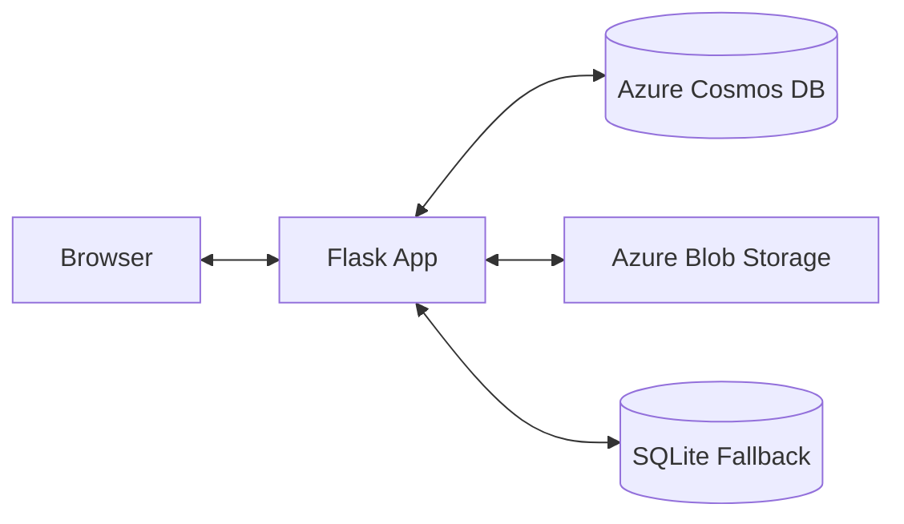

# ☁️ CloudBeats

**Music streaming, simplified.**

CloudBeats is a personal cloud music locker built with Flask and Azure Blob Storage. Upload, store, and stream your music from anywhere.


---

## ✨ Features

- 🎵 **Seamless Streaming** — Advanced music player with seek support (supports HTTP range requests)
- ☁️ **Azure Integration** — Dual-cloud architecture using **Azure Blob Storage** for audio files and **Azure Cosmos DB** for metadata.
- ⚡ **Background Processing** — Uploads are synced to Azure in the background for a snappy user experience.
- 🌗 **Adaptive UI** — Smooth Dark / Light mode toggle with persistent user preferences.
- 📱 **Responsive Design** — Modern, mobile-first interface built with Bootstrap 5.
- � **Progressive Uploads** — Real-time upload progress tracking for large audio files.
- � **Hybrid Storage** — Intelligent fallback to local SQLite and file storage when cloud services are unavailable.

---

## 🛠️ Tech Stack

| Layer | Technology |
|---|---|
| **Backend** | Python 3.10+, Flask |
| **Cloud Storage** | Azure Blob Storage |
| **Cloud Database** | Azure Cosmos DB (NoSQL) |
| **Local Database** | SQLite (Fallback) |
| **Frontend** | HTML5, CSS3, Bootstrap 5, Font Awesome |
| **CI/CD** | GitHub Actions |
| **Server** | Gunicorn (Production) |

---

## ☁️ Azure Services Used

| Service | Purpose | Usage in Project |
|---|---|---|
| **Azure Blob Storage** | Audio File Hosting | High-performance storage and CDN-ready streaming |
| **Azure Cosmos DB** | Metadata Management | Globally distributed NoSQL database for song details |
| **Azure App Service** | Web Hosting | Scalable Linux-based environment for the Flask application |
| **GitHub Actions** | CI/CD | Automated build and deployment pipeline |

### Architecture



---

## 🚀 CI/CD Pipeline

This project features a robust **GitHub Actions** workflow for continuous deployment:

- **Automation**: Every push to `main` triggers a build and deploy.
- **Environment**: Builds on `ubuntu-latest` with Python 3.10.
- **Deployment**: Deploys directly to the Azure Web App slot.

View the configuration: [.github/workflows/main_cloudbeats-app.yml](.github/workflows/main_cloudbeats-app.yml)

---

## 🚀 Getting Started

### Prerequisites
- Python 3.10+
- Azure Subscription (Free tier compatible)

### Local Setup

1. **Clone & Install**:
   ```bash
   git clone https://github.com/srisugumar2003/cloudbeat.git
   cd cloudbeat
   python -m venv venv
   .\venv\Scripts\activate # Windows
   pip install -r requirements.txt
   ```

2. **Environment Variables**:
   Copy `env.example` to `.env` and fill in your Azure credentials:
   ```env
   AZURE_STORAGE_CONNECTION_STRING=...
   AZURE_STORAGE_CONTAINER_NAME=music-container
   COSMOS_ENDPOINT=...
   COSMOS_KEY=...
   ```

3. **Run**:
   ```bash
   python app.py
   ```

---

## 📁 Project Structure

```text
cloudbeat/
├── app.py                 # Core application logic & Azure integration
├── requirements.txt       # Dependencies (Flask, Azure SDKs, etc.)
├── verify_azure.py        # Diagnostic tool for Azure connectivity
├── deploy_to_azure.sh     # Manual deployment script for Linux
├── deploy.bat             # Local setup utility for Windows
├── .github/workflows/     # CI/CD pipeline definitions
├── static/                # CSS, JS, and global assets
├── templates/             # HTML UI templates
└── env.example            # Template for environment configuration
```

<p align="center">
  Built with ❤️ by <a href="https://github.com/srisugumar2003">srisugumar2003</a>
</p>
